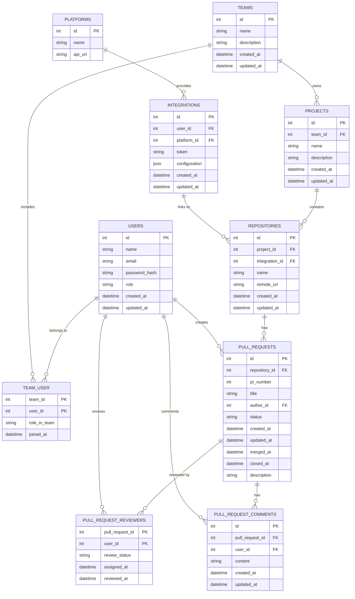

#

```mermaid
erDiagram
    USERS {
      int id PK
      string name
      string email
      string password_hash
      string role
      datetime created_at
      datetime updated_at
    }
    
    TEAMS {
      int id PK
      string name
      string description
      datetime created_at
      datetime updated_at
    }
    
    TEAM_USER {
      int team_id PK
      int user_id PK
      string role_in_team
      datetime joined_at
    }
    
    PROJECTS {
      int id PK
      int team_id FK
      string name
      string description
      datetime created_at
      datetime updated_at
    }
    
    PLATFORMS {
      int id PK
      string name
      string api_url
    }
    
    INTEGRATIONS {
      int id PK
      int user_id FK
      int platform_id FK
      string token
      json configuration
      datetime created_at
      datetime updated_at
    }
    
    REPOSITORIES {
      int id PK
      int project_id FK
      int integration_id FK
      string name
      string remote_url
      datetime created_at
      datetime updated_at
    }
    
    PULL_REQUESTS {
      int id PK
      int repository_id FK
      int pr_number
      string title
      int author_id FK
      string status
      datetime created_at
      datetime updated_at
      datetime merged_at
      datetime closed_at
      string description
    }
    
    PULL_REQUEST_REVIEWERS {
      int pull_request_id PK
      int user_id PK
      string review_status
      datetime assigned_at
      datetime reviewed_at
    }
    
    PULL_REQUEST_COMMENTS {
      int id PK
      int pull_request_id FK
      int user_id FK
      string content
      datetime created_at
      datetime updated_at
    }
    
    %% Relacionamentos
    USERS ||--o{ TEAM_USER : "belongs to"
    TEAMS ||--o{ TEAM_USER : "includes"
    
    TEAMS ||--o{ PROJECTS : "owns"
    PROJECTS ||--o{ REPOSITORIES : "contains"
    
    INTEGRATIONS ||--o{ REPOSITORIES : "links to"
    PLATFORMS ||--o{ INTEGRATIONS : "provides"
    
    REPOSITORIES ||--o{ PULL_REQUESTS : "has"
    USERS ||--o{ PULL_REQUESTS : "creates"
    
    PULL_REQUESTS ||--o{ PULL_REQUEST_REVIEWERS : "reviewed by"
    USERS ||--o{ PULL_REQUEST_REVIEWERS : "reviews"
    
    PULL_REQUESTS ||--o{ PULL_REQUEST_COMMENTS : "has"
    USERS ||--o{ PULL_REQUEST_COMMENTS : "comments"
```